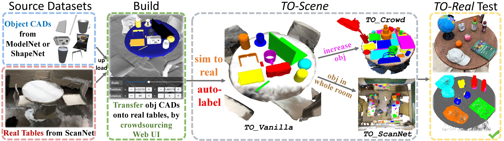

# TO-Scene: A Large-scale Dataset for Understanding 3D Tabletop Scenes


By [Mutian Xu*](https://mutianxu.github.io/), [Pei Chen*](), [Haolin Liu](), and [Xiaoguang Han](https://gaplab.cuhk.edu.cn/)

## Introduction
This repository is built for:

__TO-Scene__: A Large-scale Dataset for Understanding 3D Tabletop Scenes ___(ECCV2022 Oral)___ [[arXiv](https://arxiv.org/abs/2203.09440)]
<br>

If you find our work useful in your research, please consider citing:

```
@inproceedings{xu2022toscene,
  title={TO-Scene: A Large-scale Dataset for Understanding 3D Tabletop Scenes},
  author={Xu, Mutian and Chen, Pei and Liu, Haolin and Han, Xiaoguang},
  booktitle={ECCV},
  year={2022}
}
```

## Dataset

TO-Scene contains 20,740 scenes with three different variants which are TO_Vanilla, TO_Crowd, TO_ScanNet.

### 1. Full TO-Scene Data:
- You can download our dataset with the corresponding variants from Google Drive:

| Format                                                     | TO_Vanilla                                                   | TO_Crowd                                                     | TO_ScanNet                                                   |
| ---------------------------------------------------------- | ------------------------------------------------------------ | ------------------------------------------------------------ | ------------------------------------------------------------ |
| **ply** (point cloud)                                      | [Download (4.3GB)](https://drive.google.com/file/d/1oQ75oC-Q9BpmVQsON-qEvoe-oJbQkSsI/view?usp=sharing) | [Download (2.1GB)](https://drive.google.com/file/d/1s0WsuhNJABC2nE9hcZN3_rtSJoj2612t/view?usp=sharing) | [Download (4.3GB)](https://drive.google.com/file/d/1j4FWu09lTrF3euUA9PJ6fMhSclLlxyVh/view?usp=sharing) |
| **npz** (xyz, color, semantic_label, instance_label, bbox) | [Download (6.2GB)](https://drive.google.com/file/d/1ruXvISeADT3ERwcxjXgKfAINVy6KZJyy/view?usp=sharing) | [Download (2.8GB)](https://drive.google.com/file/d/1dgMjMUwT5DxhBDgIZYLqrP_OD_R2xf_V/view?usp=sharing) | [Download (6.5GB)](https://drive.google.com/file/d/12IVVEt5kUQrz0_Qis58TH6Fj4yr6cJTo/view?usp=sharing) |

- Alternatively, for mainland China users, we also provide Baiduyun link:

| Format                                                     | TO_Vanilla                                                   | TO_Crowd                                                     | TO_ScanNet                                                   |
| ---------------------------------------------------------- | ------------------------------------------------------------ | ------------------------------------------------------------ | ------------------------------------------------------------ |
| **ply** (point cloud)                                      | [Download (4.3GB)](https://pan.baidu.com/s/1r0D6HnjHJC2eR-Ifwo6Iig?pwd=0000) | [Download (2.1GB)](https://pan.baidu.com/s/1jlrhJkFr00AXce55miRRmw?pwd=0000) | [Download (4.3GB)](https://pan.baidu.com/s/1wbynKbxWr4nNZLrBPSIAJw?pwd=0000) |
| **npz** (xyz, color, semantic_label, instance_label, bbox) | [Download (6.2GB)](https://pan.baidu.com/s/1yXlFv5X8byEkuoFtuSAVUg?pwd=0000) | [Download (2.8GB)](https://pan.baidu.com/s/1mMJhOo-6uXMR9RPz3snG0g?pwd=0000) | [Download (6.5GB)](https://pan.baidu.com/s/1D-_M6L4iu5S7eRGgXQI0RA?pwd=0000) |


### 2. Meta data:

You may also need to download **meta_data** at [Google Drive](https://drive.google.com/file/d/16E1Gb91ctGysmWhbeUwYF3-ssQ1Dw0Rm/view?usp=sharing) or [Baiduyun](https://pan.baidu.com/s/1jr2JHvxYS1cI3O0xb78lmQ?pwd=0000), including **train/val/test split** in format of .txt and pre-calculated **mean_size_arr** (mean size of objects of different classes).

## Benchmark on TO-Scene

We have provided the code implementations for running [3D semantic segmentation](./sem_seg) and [3D object detection](./obj_det) on our dataset.

Note that TO-scene dataset contains 60,174 tabletop object instances from 52 common classes. For reference, we show these small object classes below, which also can be downloaded [here](./classes.txt).

**Big furniture**

| Class | Semantic | Class | Semantic  | Class |   Semantic    |
| :---: | :------: | :---: | :-------: | :---: | :-----------: |
|   3   | cabinet  |   9   |  window   |  24   | refrigerator  |
|   4   |   bed    |  10   | bookshelf |  28   | showercurtain |
|   5   |  chair   |  11   |  picture  |  33   |    toilet     |
|   6   |   sofa   |  12   |  counter  |  34   |     sink      |
|   7   |  table   |  14   |   desk    |  36   |    bathtub    |
|   8   |   door   |  16   |  curtain  |  39   |  garbagebin   |

**Small objects**

| Class | Semantic | Class |    Semantic    | Class | Semantic       | Class |  Semantic  |
| :---: | :------: | :---: | :------------: | ----- | -------------- | :---: | :--------: |
|  41   |   bag    |  54   |     laptop     | 67    | chessboard     |  80   |   mirror   |
|  42   |  bottle  |  55   |   microphone   | 68    | coffee_machine |  81   |  notebook  |
|  43   |   bowl   |  56   |   microwave    | 69    | comb           |  82   |   pencil   |
|  44   |  camera  |  57   |      mug       | 70    | cutting_board  |  83   |   plant    |
|  45   |   can    |  58   |    printer     | 71    | dishes         |  84   |   plate    |
|  46   |   cap    |  59   | remote_control | 72    | doll           |  85   |   radio    |
|  47   |  clock   |  60   |     phone      | 73    | eraser         |  86   |   ruler    |
|  48   | keyboard |  61   |     alarm      | 74    | eye_glasses    |  87   |  saucepan  |
|  49   | display  |  62   |      book      | 75    | file_box       |  88   |   spoon    |
|  50   | earphone |  63   |      cake      | 76    | fork           |  89   |  tea_pot   |
|  51   |   jar    |  64   |   calculator   | 77    | fruit          |  90   |  toaster   |
|  52   |  knife   |  65   |     candle     | 78    | globe          |  92   |    vase    |
|  53   |   lamp   |  66   |    charger     | 79    | hat            |  93   | vegetables |

## Contact

If you have any questions, please contact Mutian Xu (mutianxu@link.cuhk.edu.cn) or Pei Chen (mikecp006@gmail.com).

## News
The dataset challenge will be released soon, via a complete website!